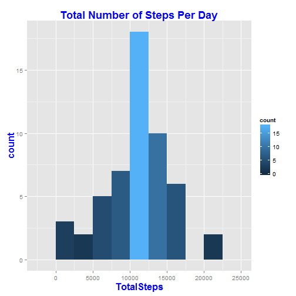
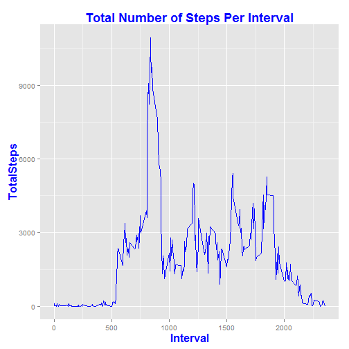
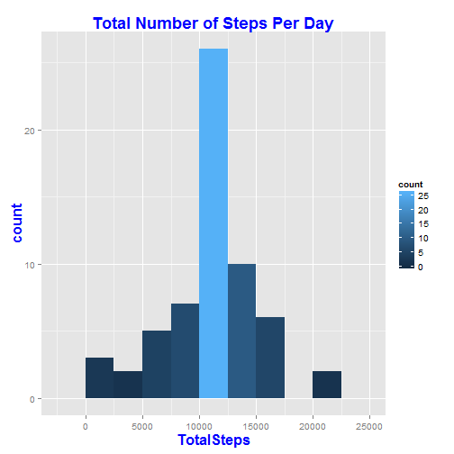
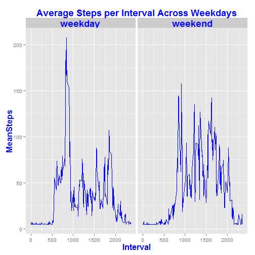

First I have to set the working directory and load the data.  

```r
setwd("~/Coursera/ReproducibleAssignment1")
activity<- read.csv("activity.csv")
```

I should also process the data, just to make things easier later on.

```r
activity$date<- as.Date(activity$date, format="%Y-%m-%d")
```

Next I'd like to get an idea of how many steps are taken per day.  I'm also going to load ggplot2 and graph the histogram with that.


```r
aggregated<-aggregate(activity$steps, by = list(activity$date), FUN = sum)

aggregated[,1 ]<- (1:61)

names(aggregated)<- c("Day", "TotalSteps")
library(ggplot2)

g<- ggplot(aggregated, aes(x=TotalSteps))
plot1<- g+ geom_histogram(binwidth=2500,aes(fill=..count..)) + ggtitle("Total Number of Steps Per Day") + theme(plot.title=element_text(size=rel(1.5), face="bold", colour = "blue"), axis.title.x=element_text(size=16, lineheight=.9, face="bold", colour="blue"), axis.title.y=element_text(size=16, lineheight=.9, face="bold", colour="blue"))

plot1
```

 

What about a mean total number of steps?


```r
mean(aggregated$TotalSteps, na.rm=TRUE)
```

```
## [1] 10766
```

 Median?
 

```r
 median(aggregated$TotalSteps, na.rm=TRUE)
```

```
## [1] 10765
```
 
 
Next up, if I am going to get the number of steps taken across all the 5 minute intervals across all the days, I can use aggregate to do this:


```r
aggregated1<-aggregate(activity$steps, by = list(activity$interval), FUN = sum, na.rm=T)
names(aggregated1)<- c("Interval", "TotalSteps")
```

I then want to plot this data so that we can get a sense of how many steps are taken in each 5 minute interval.


```r
f<- ggplot(aggregated1, aes(Interval, TotalSteps))
 f+geom_line(size=0.5, colour="blue")+ ggtitle("Total Number of Steps Per Interval")+ theme(plot.title=element_text(size=rel(1.5), face="bold", colour = "blue"), axis.title.x=element_text(size=16, lineheight=.9, face="bold", colour="blue"), axis.title.y=element_text(size=16, lineheight=.9, face="bold", colour="blue"))
```

 

To answer the question of which 5 minute interval (on average across all the days in the dataset) contains the maximum number of steps I am going to aggregate the step data by interval, and then order it.

```r
IntervalOrder<-aggregated1[order(aggregated1[,2],decreasing=T),]
```

```
## Error: 'decreasing' must be TRUE or FALSE
```

```r
head(IntervalOrder)
```

```
##     Interval TotalSteps
## 104      835      10927
## 105      840      10384
## 107      850       9720
## 106      845       9517
## 103      830       9397
## 101      820       9071
```
As you can see, it appears the most steps were taken at the 835 interval.  Roughly 10,927 steps in that interval.


It seems as if there are some missing values, and I'd like to remove those in order to get a better look at the data.  Firstly I just need to look at how many NA's there are.


```r
sum(is.na(activity))
```

```
## [1] 2304
```
It appears there are quite a few missing data points.  I'd like to replace them, and I chose to replace them with the mean from that day.  To me this makes more sense than replacing it with zero as that would skew the mean downwards.  As per the lecture in class, in real research I may NOT replace them, but for this homework I wanted to see what would happen.


```r
mean1<- mean(activity$steps, na.rm=TRUE)
NewDataSet<- activity
NewDataSet[is.na(NewDataSet$steps),]$steps <- mean1
```

Next lets look at the mean of this new data set we created.  I need to group it by day again first

```r
aggNew<-aggregate(NewDataSet$steps, by = list(NewDataSet$date), FUN = sum)
aggNew[,1 ]<- (1:61)
names(aggNew)<- c("Day", "TotalSteps")
mean(aggNew$TotalSteps, na.rm=TRUE)
```

```
## [1] 10766
```

Looks about the same, lets check the median.

```r
median(aggNew$TotalSteps, na.rm=TRUE)
```

```
## [1] 10766
```
Changed just barely towards the mean.
Now lets just repeat our histogram but with the new dataset


```r
b<- ggplot(aggNew, aes(x=TotalSteps))
plot5<- b+ geom_histogram(binwidth=2500,aes(fill=..count..)) + ggtitle("Total Number of Steps Per Day") + theme(plot.title=element_text(size=rel(1.5), face="bold", colour = "blue"), axis.title.x=element_text(size=16, lineheight=.9, face="bold", colour="blue"), axis.title.y=element_text(size=16, lineheight=.9, face="bold", colour="blue"))

plot5
```

 


Looks very similar except the middle column is much larger, which makes sense as those were what all the missing values were switched to.


Now that I have filled in the missing values, I am going to look at the differences between steps on weekdays and weekends.  I am going to use the weekdays() function and a graph to do so.


```r
weekdays<-weekdays(NewDataSet$date, abbreviate=TRUE)
WeekdayDataFrame<- cbind(NewDataSet,weekdays)
dayType<- ifelse(WeekdayDataFrame[, 4] %in% c("Sat", "Sun"), "weekend", "weekday")
WeekdayDataFrame<- cbind(WeekdayDataFrame,dayType)
FinalGraphs<- aggregate(WeekdayDataFrame$steps ~ WeekdayDataFrame$interval+WeekdayDataFrame$dayType, data= WeekdayDataFrame, mean)
names(FinalGraphs)<- c("Interval", "DayType", "MeanSteps")
```

This gave me a data frame called "FinalGraphs" that has three columns, Interval, DayType and MeanSteps.  I can use this to graph two side by side pltos comparing the average steps taken during weekdays with the average steps taken on weekends.  

I'd now like to use ggplot2 to graph these:


```r
T<- ggplot(FinalGraphs, aes(x=Interval, y=MeanSteps)) 
FinalPlot<- T+geom_line(size=0.5, colour="blue") + facet_grid(.~ DayType) 
FinalPlot + ggtitle("Average Steps per Interval Across Weekdays") + theme(plot.title=element_text(size=rel(1.5), face="bold", colour = "blue"), axis.title.x=element_text(size=16, lineheight=.9,face="bold", colour="blue"), axis.title.y=element_text(size=16, lineheight=.9, face="bold", colour="blue"))+ theme(strip.text = element_text(face="bold", size=rel(1.5), colour = "blue"))
```

 

